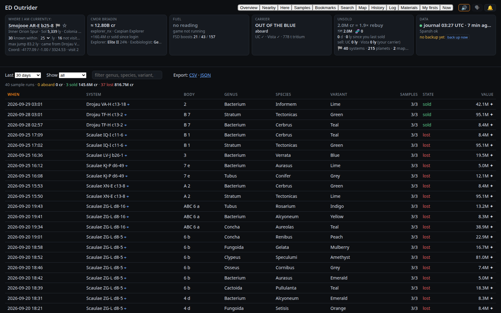
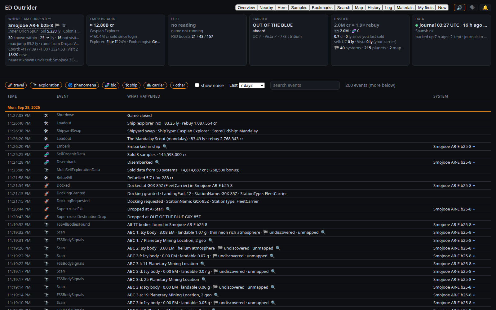
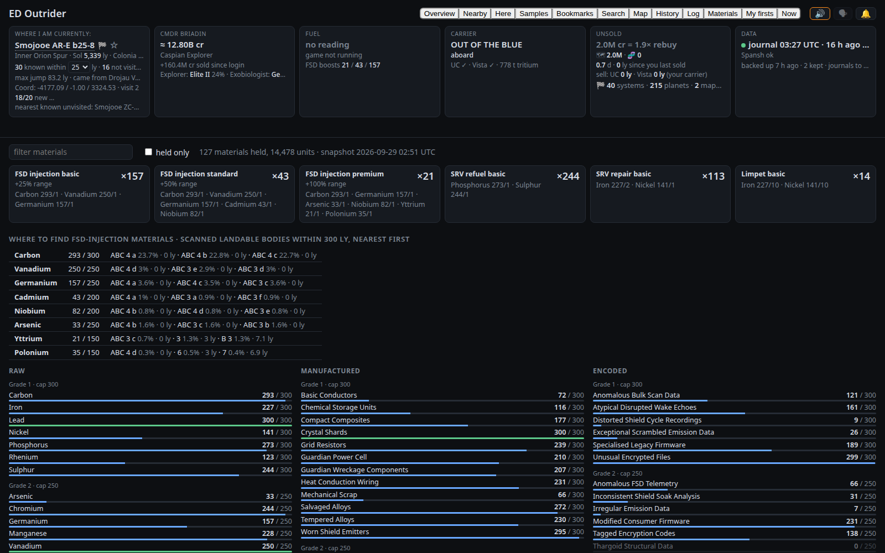
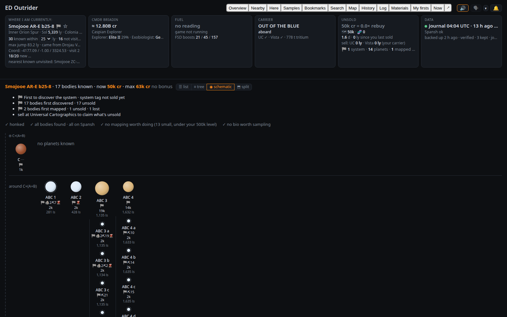

<p align="center">
  
</p>

<p align="center">
  <b>Know what's around you, what you're standing on, and what you're carrying — while you fly.</b>
</p>

<p align="center">
  
  
  
  
</p>

---

ED Outrider reads your Elite Dangerous journals as you play and keeps one browser tab up to date
with the things an explorer keeps alt-tabbing to find out: **whether anyone has been to the
systems near you, what's in the one you're in, what your unsold data is worth, and whether you're
about to jump away from something you'll regret leaving.**

It runs on your own machine. It asks [Spansh](https://spansh.co.uk) (and
[EDSM](https://www.edsm.net) as a backup) what the community already knows about the systems
around you, then layers your own scans on top — nothing is ever uploaded.

<p align="center">
  
</p>

## ✨ At a glance

| | |
|---|---|
| 🔭 **Find the undiscovered** | Every known system within 25 ly is listed. If the galaxy map shows one that *isn't* on the page, nobody with an uploader has been there. |
| 🔊 **Hear it before you jump** | Target a system and get a fanfare if it's a brand-new discovery, a cheerful note if it's known but unscanned, a thud if it's been done. Arrive somewhere nobody has been and the voice says so. |
| 🪐 **See the whole system** | Every body: value as scanned and if mapped, gravity, atmosphere, rings with hotspots and density, curiosities, and which exobiology species it could hold — before you probe or land. |
| ⚠️ **Don't leave money behind** | Target the next system with mapping or exobiology worth over your thresholds still undone (or a first-discovered Earth-like, water or terraformable world unmapped) and the page says so, out loud if you like. Ordinary systems stay quiet. |
| 💰 **Know what's on board** | Unsold cartographics and exobiology in credits, bonuses included, and how many of your 🏁 first-discovery tags are still unsold. Dock somewhere that buys it and it tells you to sell. |
| 📜 **Your logbook** | Every journal event in a searchable log, every exobiology sample with what became of it, and a schematic of the system you're in. |
| 🧭 **Decide where to go** | Visited systems nearby with work worth going back for, the nearest places that buy your data, your plotted route with its dry stretches, a bookmark as your next stop, notable stellar phenomena, and curiosities (ringed landables, close orbits, moons of moons…). |
| 🌿 **On the ground** | Landed or on foot, a strip shows what is left to sample on that body and counts down the metres to the next colony, then says "clear to sample". |
| 📈 **The long view** | Each trip from sale to sale with what it actually paid, what each ship loss cost, your most valuable finds, your ranks and the game's own career statistics. |
| 🗣 **A voice with personality** | Alerts spoken by a natural neural voice, down to business, sarcastic or sweet (with swearing versions if you like them), calling you by names you choose. It can also call out signal counts as the FSS finds them and where your frame shift drive is taking you. |
| 🎯 **Auto honk** | On Linux, Outrider can fire the Discovery Scanner for you on arrival and tell you how many bodies the system has. |
| 🚢 **Everything else** | Fuel, jumps left and FSD boosts you can synthesise, your credits and ship, where your carrier is, the last codex entry, and a 3D map with your path, your discoveries and neutron stars for boosting. |

## 🚀 Getting started

```bash
python3 -m venv .venv && .venv/bin/pip install -r requirements.txt   # Python 3.11 or newer
.venv/bin/python ed_outrider.py
```

Open **<http://127.0.0.1:8025/>** and go fly.

> [!TIP]
> The first start reads all your journals (a few seconds); after that it only reads what's new.
> Journal folders are found automatically on Windows and Steam/Proton. Click the page once so
> the browser allows sound.

`requirements.txt` also installs two optional parts: **Piper** (`piper-tts`, about 100 MB with its
runtime) for a natural speaking voice, and on Linux **evdev** for auto honk (built from source, so it
needs your distribution's Python development headers). Leave either line out if you don't want it;
Outrider works without them.

## 🖥️ The views

<table>
<tr>
<td width="50%" valign="top">
<b>Nearby</b> — every known system within range: distance, how much of it has been scanned,
the main star and whether you can scoop it, notable bodies, curiosities (🔭, hover for which bodies and
why) and a credit estimate. Sort by
distance, name or value; hide visited or fully scanned systems. The radius (20–50 ly) is a dropdown in
the header's Where tile; `radius_choices` in the config file offers other sizes.
<br><br>
</td>
<td width="50%" valign="top">
<b>Here</b> — the current system body by body, sorted by value, with bio and geo signal counts and a 🌋
on bodies with volcanism (bright where the body is landable, so its geological sites are reachable). Before
the DSS each bio signal shows the genera it could be; when a body has fewer signals than possible genera it
says "one of these" with the range they could pay. Hover a body for a summary, click it for everything
known: composition, orbit, rings, bio, curiosities, your firsts. The to-do line at the top ticks itself off
as you honk, map and sample, and lists what is worth doing in a *suggested order*: nearest to the arrival
star first, each with its rough supercruise time and what it pays per minute of it ("~2 min · 450k/min"),
and a muted "skip?" on anything under your floor (100k a minute by default). A bio body nobody had set foot
on when you scanned it is valued with the ×5 first-footfall bonus ("up to 95.0M 👣×5", here, in the leaving
alert and in the FSS debrief; your exobiology threshold still compares the bonus-free value), and carries its
gravity (amber at or over your high-gravity level) and atmosphere, so the landing is decided before the
supercruise. In a system Spansh knows, the bodies line says how many of the honk's bodies are not on Spansh
("3 bodies left to find in the FSS · 2 not on Spansh", or "all on Spansh, nothing hidden").
<br><br>
</td>
</tr>
<tr>
<td width="50%" valign="top">
<b>Map</b> — a 3D view that fills the window: left-drag to rotate, right-drag to move, scroll to
zoom. Your path in orange, systems you first discovered in gold, visited ones in blue; tick <i>boost
stars</i> for neutron stars and white dwarfs, with your boosted range drawn when you're at one.
<br><br>
</td>
<td width="50%" valign="top">
<b>History</b> — your sessions: jumps, light-years, systems first discovered, bodies mapped,
samples taken, codex entries, with an all-time row, a "since your last sale" row and the game's
own career statistics on top (and, after you quit, a <i>Last session</i> card until you next load into
the game). Below: every trip from sale to sale with what Universal Cartographics and
Vista Genomics actually paid (and, from now on, how close Outrider's estimate was), the credits per hour
and per jump, what each death cost ("−212M (148M carto, 64M bio)": the exobiology aboard counts too,
also when you died on foot and kept the ship; a loss since your last sale shows on a "→ now" row for the trip
still under way), and your 25 most valuable finds. Expand a session for its systems.
<br><br>
</td>
</tr>
<tr>
<td width="50%" valign="top">
<b>Samples</b> — every exobiology sample run: species, variant, body, value (×5 where nobody had set
foot), and whether it is still <i>aboard</i>, <i>sold</i> or was <i>lost</i> with a ship. Filter by
state or text, sort any column, export. Your codex entries sit underneath.
<br><br>
</td>
<td width="50%" valign="top">
<b>Log</b> — every journal event, newest first, one readable line each: jumps, scans, signals,
samples, docking, sales, synthesis. Filter by category and time, search any text, click a row for
the raw event. It reads the journal files directly and adds new events as they happen (the newest 1,000
while it stays open; "more" fetches older ones).
<br><br>
</td>
</tr>
<tr>
<td width="50%" valign="top">
<b>Materials</b> — raw, manufactured and encoded materials against their storage caps, and how
many FSD injections (and fuel, repair and limpet syntheses) you can make right now. The FSD boost
count also sits in the header's fuel tile.
<br><br>
</td>
<td width="50%" valign="top">
<b>Schematic</b> — the <b>Here</b> view switches between <i>list</i> (most valuable first), <i>tree</i> (the same
table in orbital order, moons indented under their planets) and <i>schematic</i>. In the Here tab, <i>split</i>
keeps the schematic below whichever of list or tree is on top, and is on by default; the Overview pane
remembers its own choice. The schematic draws the
system as stars with their planets left to right and moons stacked underneath, barycentres boxed,
with your firsts, bio and geo signals, rings and values on each body. Hover and click work as in
the list.
<br><br>
</td>
</tr>
<tr>
<td width="50%" valign="top">
<b>Search</b> — systems with particular stars (or just <i>scoopable</i>), planet types, ring
types, ring hotspot minerals, or exobiology you haven't finished sampling (optionally only where the
rest pays over 1, 5 or 10 million, bonuses left out) within a radius. <i>Local</i> searches what Outrider already knows;
<i>Spansh (online)</i> searches everything anyone has reported. The name box above the criteria finds any
system by name (yours first, then EDSM), says how far it is and whether you have been there, and opens it
in Here, where its ☆ bookmarks it or makes it the next stop.
<br><br>
</td>
<td width="50%" valign="top">
<b>My firsts</b> — every visited system still holding first-discovery data you haven't sold, and
what it's worth, and <b>Left behind</b>: visited systems nearby with bodies still to find, mapping or
bio over your thresholds (including bio signals on a body you never probed with the DSS, priced as an upper
bound: "3 signals, not DSS'd ≤12.0M"). Plus <b>Bookmarks</b>: star a system, leave yourself a note, and make it your
<b>next stop</b> (its distance shows in the header until you arrive).
<br><br>
</td>
</tr>
</table>

The **Overview** (top of the page) shows Here and Nearby together — drag the divider, swap sides,
or stack them. **Now** is the cockpit view for a second monitor or a tablet: the system, the target,
fuel, and what to do next here (or what is left on the body you are standing on; "Next: honk" or the
bodies still to find before it ever says "nothing worth staying for") in big text, the body you have
targeted in the game with what the suggested order makes of it ("➜ B 1 · Icy body · 1,200 ls · ~35 s ·
nothing to do here"; when it is the next item, Next is marked ➜ instead), with the
discovery count, the nearest known unvisited system and, between quitting and your next login, the last
session. Open it directly with
`http://127.0.0.1:8025/?mode=now`; tap to go back. With the page open in two windows only one of them
speaks and plays the alert sounds (the main one, when you open both together), so nothing is said twice.
A window that was asleep (a tablet's screen off, a laptop lid shut) does not replay what it missed.

The header also shows the galactic region you are in, your ranks, a live countdown when your carrier has
a jump booked, the hull when it is damaged ("repaired" after repair limpets, whose
new percentage the journal only gives at the next Loadout), the FSD injections your materials allow, the nearest places to
sell, and when you were last backed up (see Backups, below).

Under the Where tile, the **discovery streak** is a dot for each of your last 20 arrivals, coloured when the
arrival star was scanned and never changed after: gold for a first discovery, amber for a known system with
bodies nobody had reported, blue for a fully reported one, grey for one you had visited before (marked on
arrival, since the game rarely scans a star again on a return visit), hollow when
Spansh had nothing on it at the time. Hover a dot for the system, your first discoveries and what you
scanned there; "13/20 new" counts the gold ones. Below it, the **unreported horizon**: "nearest known
unvisited: Xyz 4.8 ly · K ⛽ — unvisited stars closer than this aren't reported to Spansh or EDSM". An
unvisited star closer than that on the galaxy map is one nobody has reported (not necessarily undiscovered:
the game may know it). When the list is cut short in a crowded region it only claims as far as the list
is complete.

## 🔔 Alerts and thresholds

Alerts fire only for something out of the ordinary: a new discovery targeted, arriving somewhere nobody
has been, leaving a system with work worth coming back for (mapping or bio over your highlight levels,
or a first-discovered Earth-like, water, ammonia or terraformable world), low fuel where you cannot
scoop, a valuable body the moment the FSS resolves it (once: mapping it or scanning it again on a later
visit stays quiet), docking where the station buys a worthwhile part of your data and what you banked
when you sold, hull damage, heat damage (once per 30 seconds) and interdiction, unsold data rising past a
threshold, your carrier arriving somewhere new or leaving without you, a new codex entry. Spoken but not
notified unless you tick it (each has its own row): a one-sentence briefing on arrival, the FSS debrief,
leaving a body with sampling unfinished and each species completed, the tank full after scooping, and a
high-gravity landing with a lot of data aboard (see the voice, below), and a discovery streak (ten fully
known systems in a row, "maybe change heading", or five undiscovered ones in a row, in place of the plain
"undiscovered"; once per streak, thresholds in the dialog, 0 turns one off). Ordinary systems stay quiet. Walking about a station on foot counts as still docked, and the undock warning
comes from the game's own Undocked event.

A carrier jump booked while the game is not running (booked just before you quit) is assumed done five
minutes after its departure time: the carrier tile shows the destination as "not yet confirmed" until
your next login confirms it.

Each alert can play its own sound (🔊), show a desktop notification, and be spoken (🗣), chosen per
alert in the **🔔 alerts** dialog. Targeting a system plays its sound (the fanfare for an unreported
system); arriving there is announced by the voice, and the arrival only plays a sound to correct a
targeting call that turned out wrong. The same dialog holds the thresholds:

- **Exobiology** — only count a body as unfinished if a single body could pay over a certain
  amount (default 10 million), so one bacterium doesn't nag you.
- **Unsold data** — when the header turns amber (default 50 million on board) and red (250 million),
  or as a multiple of your ship's rebuy.
- **Body highlights** — in Here, a body's row turns green when its scan + map data pays over a level
  (default 500 thousand), and its bio turns violet when its species could pay over another (default
  10 million). Both use straight payouts with no first-discovery, mapping or footfall bonus. The
  config file's `body_highlight_level` and `biology_highlight_value` set the defaults.
- **Approach warning** — the high-gravity level (default 2 g, `high_gravity`, 0.1 g or more) at which dropping into
  orbital cruise at a landable body warns you, when the data aboard is over the amber level or the rebuy
  multiple.
- **Max with or without bonuses** — whether Here's Max column (and the system's max total) counts
  first-discovery, first-mapped and first-footfall bonuses. On by default; the config file's
  `body_max_value_include_bonus` sets it. Now always includes the bonuses you have earned.
- **Discovery streak** — how many fully known (default 10) or undiscovered (default 5) systems in a row
  get a spoken line (0 turns one off; the smallest streak is 2).
- **Suggested order** — the credits per minute of supercruise under which Here marks an item "skip?"
  (default 100 thousand).

Everything you change there is remembered by your browser; the config file sets what a new browser starts with.
**Export settings** saves them to a file and **Import settings** loads one (the page reloads), for a new
browser profile or after clearing the cache. **Use these for new browsers** keeps a copy on the server
(`browser_defaults.json` next to the database, included in backups): a browser uses it for anything it has
not set itself, before the config file's defaults, so a tablet running Now starts with your personalities,
names and alert choices. The view, layouts, the search form and which screen speaks stay per device.

## 💾 Backups

Outrider backs itself up: at start when the last backup is more than a day old (`backup_every_days`), and
a few seconds after you quit the game to the desktop; **back up now** in the Data tile does the same on
demand (once a minute at most). Each backup is a dated zip in `backups/` next to the script holding a
consistent copy of the database (and `browser_defaults.json`, the speech file in use and your config file,
when they exist: nothing rebuilds those from the journals), named after the database and stamped in UTC
(`outrider-ed_outrider-20260930-181500Z.zip`), and the newest 7 are kept (`backup_keep`); older zips are
deleted only after a new one has been written, and nothing else in the folder is ever touched (a second
copy run with `--db` shares the folder but rotates only its own zips). Your journals are the part nothing else can rebuild (under Steam/Proton they live inside a
prefix that an uninstall deletes), so every live journal is copied once into `backups/journals/` as a
plain file, brought up to date whenever it grows, and never replaced by a smaller or different file or
deleted (a journal that cannot be copied is reported on the Data tile; the zip still counts). The Data tile reads "backed up 3 h
ago · 7 kept · journals to 2026-09-28", amber when a backup is overdue or when it worked but a journal could not be
archived ("backed up 3 h ago · 1 journal not archived (…)", the details on hover), and red when the last one
failed (no zip written). Its hover lists what the last zip holds.
`backup_every_days = 0` turns the automatic ones off.

**Restoring.** The journals are enough to rebuild everything: point Outrider at the archive with
`python3 ed_outrider.py --legacy backups/journals` (or add it to `legacy` in the config file) and it
reads them into a fresh database. To get the database itself back (bookmarks, the Spansh cache, your
voice choice), stop Outrider and unzip `ed_outrider.sqlite` from the newest `outrider-ed_outrider-*.zip`
over the old one (backups made before the zips were named after the database are `outrider-YYYYMMDD-HHMMSS.zip`).
Your `speech.json` and `ed_outrider.toml` are in the zip too: unzip only the files you changed, since a `speech.json`
from a backup replaces any lines an update has added since.

## 🗣 The voice

Alerts are spoken when 🗣 in the header is on. **Piper**, a neural voice that runs on your CPU, sounds
far better than the browser's own voice (fine on Windows and macOS, robotic on Linux), which is used
when Piper isn't installed. Browsers only play Piper's audio after you have clicked the page once; until
then lines go to the browser's voice and the page says so. The voice (`voice` in the config file, default a southern English female
voice, with `voice_fallback` as the backup) is downloaded into `piper-voices/` the first time (an
interrupted download leaves nothing behind and is simply tried again next start). When the fallback is
already installed it speaks at once while the configured voice downloads, and the configured one takes over
when it has loaded (the dialog's status line says so); the
dialog switches between installed voices; a voice picked there is remembered over restarts (once it has
loaded: one that fails leaves the working voice speaking) and wins over the config file from then on. A very
long line (over 1000 characters) is cut at the last sentence or clause that fits, never mid-word; the leaving
alert names three things at most aloud ("…, and 2 more"), the notification lists them all. A `.venv` next to the script is found even when you start
Outrider with plain `python3 ed_outrider.py`.

- **Personalities.** Every alert has fifty versions in each personality in `speech.json`: down to
  business, sarcastic and sweet. Tick any mix and each alert picks a line at random from all of them,
  never one you have just heard. **With profanity** adds the swearing versions of sarcastic and sweet,
  used the percentage of the time set beside it (50% by default, `speech_profanity_pct`). **One personality
  per system** draws one of the ticked personalities at each arrival (and at game start) and lets it say
  every line until the next, so a character, and its own voice, holds through a system.
- **Down to business when it matters.** With **Danger alerts always down to business** ticked (the
  default, `speech_danger_business`), hull, heat, interdiction, low fuel or an unscoopable star, and your
  carrier leaving without you (and the ship-loss debrief) are said only in the business lines, never sworn, whatever personalities
  are ticked. (A `speech.json` of your own without business lines for them uses the ticked ones.)
- **Most urgent first.** Lines wait their turn in a queue, but danger goes to the front (and cuts short a
  find being read out), then arrivals, jumps, the honk and selling, then finds, signals and codex. A line
  that waited over 20 seconds is dropped, and so is one about a system you have since left (a find, a
  signal count, "charging to jump" once you have arrived) or "clear to sample" once you have taken the
  sample. Heat and interdiction are said at most once in 30 seconds. When the frame shift drive starts
  charging for a jump, everything queued or being read out is dropped and "charging to jump" is said
  instead (danger lines, and anything you asked for with ▶, are kept).
- **One window speaks.** With the page open in several windows or tabs, only one speaks and plays the
  alert sounds (the first opened; when it closes the next takes over; **speak from this window** in the
  dialog takes over at once), while every window still shows the alerts. **This screen speaks: auto /
  always / never** changes that for the browser. The ▶ try buttons always work. (Browsers that cannot tell
  their windows apart, such as one opening the page from another device over plain http, speak in every
  window.)
- **Your names.** Commander names are often unpronounceable, so the voice calls you by the names in
  **Call me** instead (comma separated, a random one each time; default "Boss, Hefay, Sir",
  `speech_names` in the config file).
- **Speed.** 1× is the voice's own pace (`speech_speed` sets the default). How much faster a setting
  sounds depends on the voice: some Piper models respond less than others.
- **Extra call-outs.** Signal counts as the FSS finds them ("2 Biological and 1 Geological Signals found
  on body A 3", one tick each, `speak_bio_signals` and `speak_geo_signals`); "Frame Shift Drive charging
  to jump to …", adding "This star is scoopable" when it is, and the hazard for a neutron star, white
  dwarf or black hole ("Neutron star ahead: throttle down on arrival", its own tick); a greeting when you
  load into the game (after a break of over two hours, what is at stake: "Away 3 days. 412 million aboard,
  unsold for 5 days. Fuel 64 percent. Docked at Jaques Station.", the amount only past the amber level and
  left to the dock alert when that says it anyway), and a goodbye when you quit that recaps a session of three jumps or more ("142
  jumps, 3,100 light-years, 12 systems nobody had seen and 9 species sampled").
- **Arrival briefing.** After the honk (yours or the auto honk's, whose own "System Scan Completed" line
  then stays quiet), or 12 seconds after arriving without one, one sentence: discovered or not, the body
  count, the star, the most valuable planet you have not mapped over your body highlight level (or any
  Earth-like, water, ammonia or terraformable one) and the richest bio over your exobiology level:
  "Known. 12 bodies. Scoopable M star. The Earth-like world at A 2 is unmapped, 1.4 million." In a system
  Spansh knows, it adds how many of the bodies Spansh has no record of ("3 of them not on Spansh"). Low fuel and
  "you are the first here" stay lines of their own.
- **FSS debrief.** When the FSS has found every body: what is worth doing ("All 14 found. Worth it: B 1,
  Earth-like world, 3.1 million to map, and biology on C 2, up to 19 million"), or that nothing is worth
  staying for. Not after a honk that found everything (the briefing said so). Closing the FSS with bodies
  still unresolved in a system you honked says how many are hidden, once per visit.
- **Exobiology.** Leaving a body for supercruise (not lifting off between sample sites) with a species
  at 1 or 2 of 3 always warns; genera the DSS found that you have not started warn only if you landed or
  sampled there this visit, and only those over your exobiology level ("Stratum 2 of 3, and Tussock
  untouched, up to 12 million"). Unfinished, not lost: your journals show runs carrying on after leaving
  the body. The system's leaving alert then skips what that warning named (once it was spoken or notified).
  The third sample of a species says
  what it pays (with the first-footfall ×5) and what is left worth sampling on that body, or that it was
  the last.
- **Approach.** Dropping into orbital cruise at a landable body at or over the high-gravity level
  (default 2 g) with unsold data over the amber level or the rebuy multiple: "2.6 g. 480 million aboard,
  3.2 rebuys. Land gently." Once per body per session. The bio briefing on approach (what the signals
  could be) is off by default, since the FSS already said it; ticked, it joins the same sentence (or is
  said on its own when the approach warning is not spoken).
- **Fuel scooping.** "Tank full" when a scoop ends with the tank full, with the jumps it gives in some
  lines. "Scooping stopped at 64 percent" and "FSD supercharged, 4 times range" (after a jet cone) are off
  by default; the early stop is never said above 90% or when the scoop ended because you started a jump.
- **Ship-loss debrief.** After a rebuy, what went down with the ship, with the same figures as History, and
  the nearest system to go back to: "Lost 212 million: 148 million cartographics and 64 million
  exobiology, 31 systems and 9 first discoveries. The nearest lost system is Drojau L L O, b 26 3, 42
  light-years." A card under the header lists the five most valuable lost systems and opens My firsts with
  the lost ones shown. A death on foot that kept the ship speaks only if samples died with you.
- **System names said properly.** A procedural name's sector code is spelt out ("Drojau LL-O b26-3" is
  said "Drojau L L O, b 26 3"); hand-named systems and carrier ids are left as they are.
- **What was said, and why not.** **Spoken lines** at the bottom of the alerts dialog lists this window's
  last 100 alerts, newest first, each with its fate: said (and by which voice, after how long a wait), cut
  short, dropped (waited over 20 seconds, you left the system, replaced by newer news, a cooldown) or silent
  (speech off, not ticked, another window speaks). **copy** puts it on the clipboard. Nothing is stored.
- **Your own lines.** Edit `speech.json` to change lines, add your own, or add a whole personality (a new
  entry under `styles` and lists of that name). The page picks the changes up without a restart, and the
  dialog reports a mistake in the file while the last good copy stays in use. Numbers are spoken to a
  tenth at most ("52 million", not "52.0 million"). Notifications keep the plain wording.
- **A voice per personality.** A personality under `styles` in `speech.json` can be an object instead of
  a label, `"sarcastic": {"label": "Sarcastic", "voice": "en_US-ryan-high", "speed": 1.1}`: its lines are
  then spoken in that Piper voice (which wins over the one picked in the dialog) at your speed times its
  own. The voice must be installed (the voice lab downloads voices; Outrider never downloads one for a
  personality), otherwise the main voice says them. As many such voices as the personalities name (at least
  two, at most four) stay loaded besides the main one, each taking some 60 to 100 MB of memory. The
  browser's own voice ignores them. The dialog shows each personality's voice, and the voice lab picks it
  when you choose that personality, and plays each line in its personality's voice (with "any personality"
  too) at your speed times the personality's.

**The voice lab.** `python3 voice_lab.py` opens a small window, separate from Outrider, for hearing the
lines before you settle on a voice. Pick any installed Piper voice (and its speaker, for voices with
several) and a speed, then play a random line from any alert and personality (from the `speech_file` set in
`ed_outrider.toml`, so your own copy's lines and personalities too), filled in with made-up
values and your names, or type your own text; Save WAV keeps the audio. **▶ Audition** plays eight key
alerts in a row (greeting, arrival briefing, find, leaving, low fuel, sale, last sample, goodbye) in one
personality, or in each in turn with "any personality", each in its own voice, two seconds apart; Stop ends it. The lower half lists every Piper
voice on Hugging Face (English by default; clear the filter or type another language): double-click one
to download it into `piper-voices/`, where Outrider's voice picker finds it too. Outrider itself uses a
voice's first speaker. The lab keeps the last two voices you tried loaded and lets older ones go.

## 🎯 Auto honk

On Linux, Outrider can fire the Discovery Scanner for you. On arriving in a system by hyperspace it waits
a moment, holds Primary Fire, checks the journal for the discovery scan, and says how it went ("System
Scan Completed, 12 Bodies discovered", or "System scan complete, and all bodies were found" when the
honk found everything; while the arrival briefing is spoken, that says the body count instead). If the galaxy map, the FSS or a panel is open when it is due (Primary Fire does
nothing there), it waits until you are back in the cockpit, for up to a minute and a half, and the dialog
shows what it is waiting for. Systems you have already honked are left alone, and so are jumps in an Apex
shuttle or on another commander's ship (multicrew), which also leave your fuel figures and dock alerts
alone. It is off until you tick it
in the 🔔 alerts dialog.

- **The Discovery Scanner must be on primary fire** in the fire group that is active when you jump.
- **Primary Fire needs a keyboard binding** in Elite's controls, as its second binding if your trigger is
  the first. Outrider reads it from your active controls preset (the one chosen for ship controls),
  modifiers too (such as the Alt + Alt + K that VoiceAttack profiles use), so there is nothing to set up.
  A key held with a joystick or HOTAS modifier cannot be pressed from a virtual keyboard, so that binding is
  skipped for the other one. `[autohonk] key` in the config file overrides it, alongside the delay and hold time. A built-in preset
  keeps its bindings inside the game's install, where Outrider cannot read them: save it as a custom
  preset, or set `[autohonk] key`.
- **Try it first.** The dialog's *test in 5 s* button, or `python3 ed_honk.py --test 10` from a terminal,
  counts down (click into the game) and holds Primary Fire once; the dialog then says whether the press
  worked. `python3 ed_honk.py --show` prints the binding it will press.
- It presses keys through a virtual keyboard (`evdev`; Steam's controller rule already gives you access),
  and the keys go to whichever window has focus, so switch it off before alt-tabbing away mid-jump.

## 🧭 Good to know

> [!NOTE]
> **"Not on the page" means "nobody with an uploader has reported it."** Players who don't run
> EDMC or a similar tool never reach Spansh or EDSM, so a missing system is *almost* certainly
> undiscovered. One second after you arrive, the arrival star's scan settles it — and the page
> (and the voice) says which it was.

- **Exobiology guesses are possibilities, not promises.** They come from each species' known spawn
  conditions (planet type, atmosphere, gravity, temperature, pressure, volcanism, the system's
  stars, the galactic region, nearby nebulae) as maintained by the
  [BioScan](https://github.com/Silarn/EDMC-BioScan) project, plus BioScan's colour check: a species
  that has never been seen around the kind of star a body orbits (or without certain surface
  materials) is ruled out, so Stratum never shows up at a G star. A fact that is not known yet rules
  nothing out: until every body in the system has been found, a species that needs a water giant (or
  a star you have not scanned) stays on the list. When a body has fewer signals than
  the genera it could hold, the page says so ("one of these, 1.0M to 19.0M") rather than guessing;
  the DSS tells which. The genus is usually right, the species within it sometimes isn't, so values
  are shown as "up to". Where the colour variant can be told (the surface materials for the
  material-keyed genera, or the parent star once every star in the system is known and all would give
  the same colour) it is shown after the guess, and the ✦ "new to your codex" mark checks that variant,
  so a new colour of a species you have logged is flagged too; otherwise the ✦ checks the species only.
  The rules ship with Outrider
  and each start checks GitHub for a newer set (a couple of small requests; offline, or if a download
  fails midway, it keeps the copy you have and tries again at the next start).
- **Values are estimates** using the same formula as the community tools, first-discovery and
  first-mapping bonuses included. If you employ an NPC crew member, their cut comes off
  automatically, based on what your past sales actually paid.
- **Losing your ship loses your data**, and the page tracks it: discoveries and samples that went
  down with the ship show as *lost* until you scan them again. Data you have sold is done: scanning
  a sold body again (the arrival star on a return visit) adds nothing, only mapping it still pays.

## ⚙️ Settings

<details>
<summary>Outrider needs no configuration — but everything can be changed.</summary>
<br>

Copy `ed_outrider.toml.example` to `ed_outrider.toml` next to the script and edit the lines you
need. The file explains each setting, in five sections: `[journals]` (folders that aren't
auto-detected), `[server]` (address, port, radius, database, backups and how many to keep, the speech file), `[defaults]`
(what a new browser starts with: thresholds, highlights, voice, personalities, names, speed, signal
call-outs), `[spansh]` (request limits) and `[autohonk]`. Switches take a bare `true` or `false`: a quoted
`"false"` is reported at start and the default kept, like any other value of the wrong type.
`python3 ed_outrider.py --write-config` writes one with the settings
currently in effect, and command-line flags do the same for a single run
(`python3 ed_outrider.py --help`).

**Opening the page from another device.** Outrider listens on 127.0.0.1 only, unless `[server] host`
says otherwise. It answers to any IP address (`http://192.168.1.20:8025/`), but by name only to the
names it expects: `localhost`, the configured host, and with `host = "0.0.0.0"` also this machine's own
name. That stops another web site from reading your journals through a DNS trick, which always needs a
name. If a phone or tablet opens it by some other name (a router's `mypc.lan`, say), add that name to
`[server] allowed_hosts`. Other web sites cannot press auto honk's key, start backups or change
settings either: the server refuses any change that another site's page sends, and will not speak
lines (Piper) for one. Anything on your
network can still read the page when it listens on `0.0.0.0`, because there is no password.

</details>

## 🔬 For the curious

<details>
<summary>What's in the box</summary>
<br>

| File | What it does |
|---|---|
| `ed_outrider.py` | The server and the journal reader |
| `static/` | The page (HTML, CSS, JS) — edit and reload |
| `ed_unsold.py` | The unsold-data estimate; also works on its own from the command line |
| `ed_log.py` | One-line summaries of journal events for the Log view, and the file reader behind it |
| `ed_materials.py` | Material names, grades and caps, synthesis recipes, and the running inventory |
| `ed_tts.py` | Spoken alerts with Piper (optional): voice selection, first-use download, synthesis |
| `speech.json` | The spoken alerts' lines: fifty per alert in each personality, yours to edit |
| `ed_speech.py` | Loads and checks `speech.json` (re-read when it changes); the alerts and the fill-ins each one has |
| `voice_lab.py` | A window for trying voices and lines, and downloading Piper voices |
| `ed_honk.py` | Auto honk: reads Primary Fire's keyboard binding and holds it through a virtual keyboard (Linux, optional); `--show`, `--test` |
| `ed_bio.py` | The exobiology predictor (spawn rules plus the colour check); `--backtest` scores it against your own journals, `--update-rules` fetches the rules by hand |
| `bio_rules.json` | The spawn rules, colour variants, nebula tables and region map, as fetched from BioScan, ExploData and klightspeed's region map; refreshed automatically |
| `tests/` | `python3 -m unittest discover tests`; `node tests/page_smoke.js <port>` for the page |

For overlays and other tools, `GET /api/status` returns a compact JSON status, and
`GET /api/status.txt?fields=system,region,fuel,target,unsold,body,sampling` one line for an OBS
text source. Both are read-only.

</details>

---

<p align="center">
Data from <a href="https://spansh.co.uk">Spansh</a> and <a href="https://www.edsm.net">EDSM</a>.
Exobiology spawn conditions are the community's work, as gathered by the Canonn Research Group and maintained in
<a href="https://github.com/Silarn/EDMC-BioScan">EDMC-BioScan</a>; the galactic region map is
<a href="https://github.com/klightspeed/EliteDangerousRegionMap">klightspeed's</a> (MIT); sample colony
distances and colour variants are from <a href="https://github.com/Silarn/EDMC-ExploData">EDMC-ExploData</a> (GPL-2.0).<br>
ED Outrider is free software under the <a href="LICENSE">GNU GPL v2 or later</a>.<br>
Elite Dangerous © Frontier Developments — this is a fan-made tool, not affiliated with Frontier.
</p>
