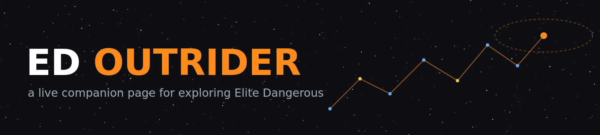
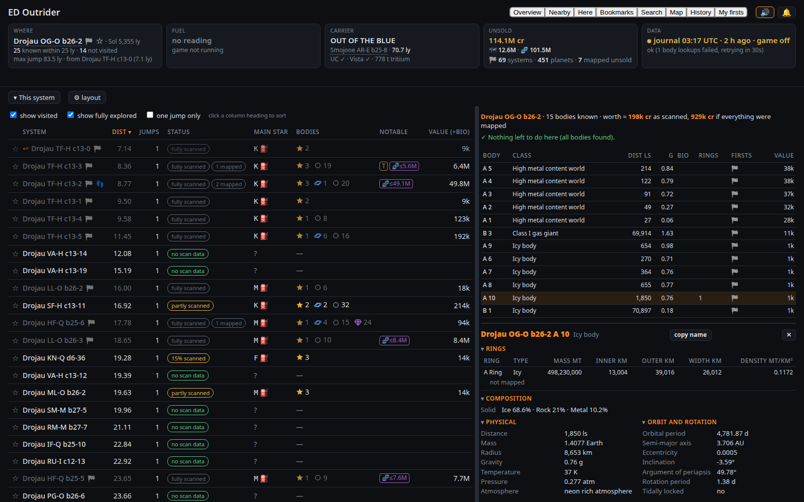
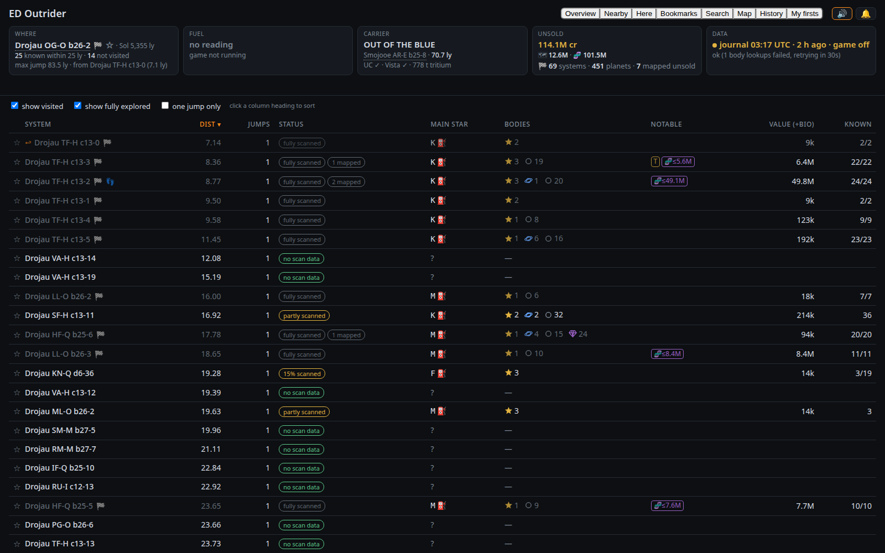
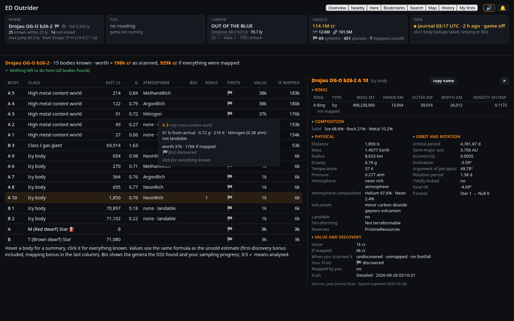
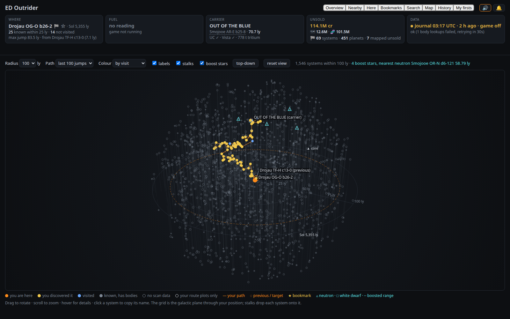
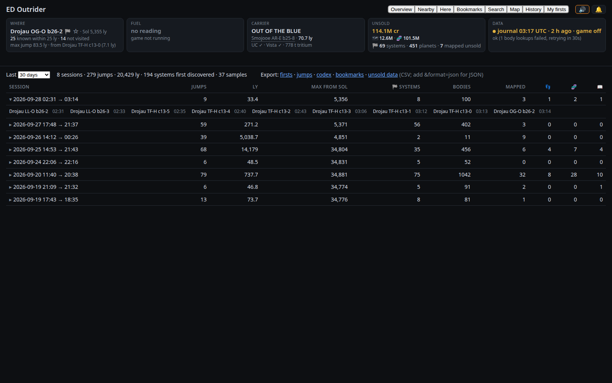
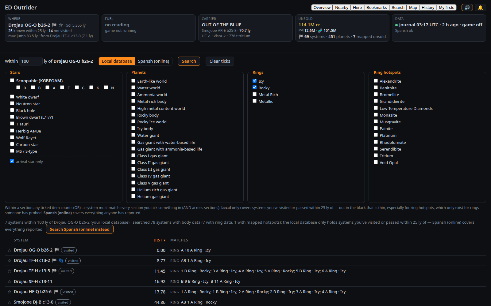
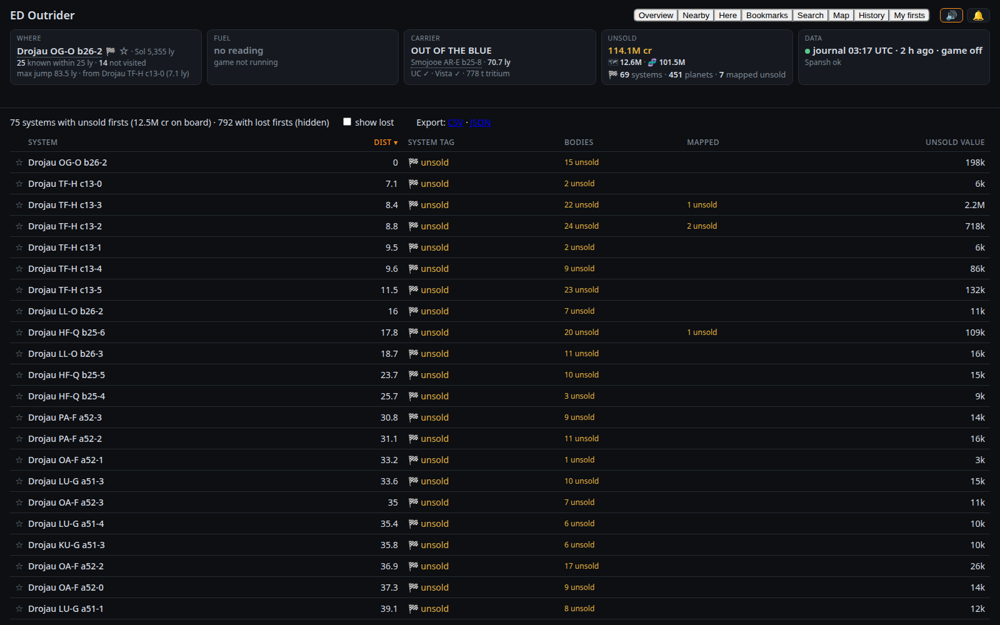

<p align="center">
  
</p>

<p align="center">
  <b>Know what's around you, what you're standing on, and what you're carrying — while you fly.</b>
</p>

<p align="center">
  
  
  
  
</p>

---

ED Outrider reads your Elite Dangerous journals as you play and keeps one browser tab up to date
with the things an explorer keeps alt-tabbing to find out: **whether anyone has been to the
systems near you, what's in the one you're in, what your unsold data is worth, and whether you're
about to jump away from something you'll regret leaving.**

It runs on your own machine. It asks [Spansh](https://spansh.co.uk) (and
[EDSM](https://www.edsm.net) as a backup) what the community already knows about the systems
around you, then layers your own scans on top — nothing is ever uploaded.

<p align="center">
  
</p>

## ✨ At a glance

| | |
|---|---|
| 🔭 **Find the undiscovered** | Every known system within 25 ly is listed. If the galaxy map shows one that *isn't* on the page, nobody with an uploader has been there. |
| 🔊 **Hear it before you jump** | Target a system and get a fanfare if it's a brand-new discovery, a cheerful note if it's known but unscanned, a thud if it's been done. |
| 🪐 **See the whole system** | Every body: value as scanned and if mapped, gravity, atmosphere, rings with hotspots and density, and which exobiology species are likely — before you probe or land. |
| ⚠️ **Don't leave money behind** | Target the next system with bodies unscanned, bio unsampled or a first-discovered water world unmapped, and the page says so. |
| 💰 **Know what's on board** | Unsold cartographics and exobiology in credits, bonuses included, and how many of your 🏁 first-discovery tags are still unsold. Dock somewhere that buys it and it tells you to sell. |
| 📜 **Your logbook** | Every journal event in a searchable log, every exobiology sample with what became of it, and a schematic of the system you're in. |
| 🚢 **Everything else** | Fuel, jumps left and FSD boosts you can synthesise, your credits and ship, where your carrier is, the last codex entry, and a 3D map with your path, your discoveries and neutron stars for boosting. |

## 🚀 Getting started

```bash
pip install aiohttp
python3 ed_outrider.py
```

Open **<http://127.0.0.1:8025/>** and go fly.

> [!TIP]
> The first start reads all your journals (a few seconds); after that it only reads what's new.
> Journal folders are found automatically on Windows and Steam/Proton. Click the page once so
> the browser allows sound.

## 🖥️ The views

<table>
<tr>
<td width="50%" valign="top">
<b>Nearby</b> — every known system within range: distance, how much of it has been scanned,
the main star and whether you can scoop it, notable bodies and a credit estimate. Sort by
distance, name or value; hide visited or fully scanned systems. The radius (20–50 ly) is a dropdown in
the header's Where tile; `radius_choices` in the config file offers other sizes.
<br><br>
</td>
<td width="50%" valign="top">
<b>Here</b> — the current system body by body, sorted by value, with bio and geo signal counts and a 🌋
on bodies with volcanism (bright where the body is landable, so its geological sites are reachable). Hover a body for a summary,
click it for everything known: composition, orbit, rings, bio, your firsts.
<br><br>
</td>
</tr>
<tr>
<td width="50%" valign="top">
<b>Map</b> — a 3D view you can spin and zoom. Your path in orange, systems you first
discovered in gold, visited ones in blue; tick <i>boost stars</i> for neutron stars and white
dwarfs, with your boosted range drawn when you're at one.
<br><br>
</td>
<td width="50%" valign="top">
<b>History</b> — your sessions: jumps, light-years, systems first discovered, bodies mapped,
samples taken, codex entries, with an all-time row on top. Expand one for the list of systems.
<br><br>
</td>
</tr>
<tr>
<td width="50%" valign="top">
<b>Samples</b> — every exobiology sample run: species, variant, body, value (×5 where nobody had set
foot), and whether it is still <i>aboard</i>, <i>sold</i> or was <i>lost</i> with a ship. Filter by
state or text, sort any column, export. Your codex entries sit underneath.
<br><br><!-- screenshot: docs/samples.png -->
</td>
<td width="50%" valign="top">
<b>Log</b> — every journal event, newest first, one readable line each: jumps, scans, signals,
samples, docking, sales, synthesis. Filter by category and time, search any text, click a row for
the raw event. It reads the journal files directly and adds new events as they happen.
<br><br><!-- screenshot: docs/log.png -->
</td>
</tr>
<tr>
<td width="50%" valign="top">
<b>Materials</b> — raw, manufactured and encoded materials against their storage caps, and how
many FSD injections (and fuel, repair and limpet syntheses) you can make right now. The FSD boost
count also sits in the header's fuel tile.
<br><br><!-- screenshot: docs/materials.png -->
</td>
<td width="50%" valign="top">
<b>Schematic</b> — the <b>Here</b> view switches between <i>list</i> (most valuable first), <i>tree</i> (the same
table in orbital order, moons indented under their planets) and <i>schematic</i>. In the Here tab, <i>split</i>
keeps the schematic below whichever of list or tree is on top, and is on by default; the Overview pane
remembers its own choice. The schematic draws the
system as stars with their planets left to right and moons stacked underneath, barycentres boxed,
with your firsts, bio and geo signals, rings and values on each body. Hover and click work as in
the list.
<br><br><!-- screenshot: docs/schematic.png -->
</td>
</tr>
<tr>
<td width="50%" valign="top">
<b>Search</b> — systems with particular stars (or just <i>scoopable</i>), planet types, ring
types, ring hotspot minerals, or exobiology you haven't finished sampling (optionally only where the
rest pays over 1, 5 or 10 million, bonuses left out) within a radius. <i>Local</i> searches what Outrider already knows;
<i>Spansh (online)</i> searches everything anyone has reported.
<br><br>
</td>
<td width="50%" valign="top">
<b>My firsts</b> — every visited system still holding first-discovery data you haven't sold, and
what it's worth. Plus <b>Bookmarks</b>: star a system and leave yourself a note.
<br><br>
</td>
</tr>
</table>

The **Overview** (top of the page) shows Here and Nearby together — drag the divider, swap sides,
or stack them.

## 🔔 Sounds and alerts

The **🔔 alerts** button turns on desktop notifications — a new discovery targeted, unfinished work
when you leave, low fuel with a non-scoopable star targeted, unsold data crossing a threshold, your
carrier arriving, a new codex entry — and holds the thresholds:

- **Exobiology** — only count a body as unfinished if a single body could pay over a certain
  amount (default 10 million), so one bacterium doesn't nag you.
- **Unsold data** — when the header turns amber (default 50 million on board) and red (250 million).
- **Body highlights** — in Here, a body's row turns green when its scan + map data pays over a level
  (default 500 thousand), and its bio turns violet when its species could pay over another (default
  10 million). Both use straight payouts with no first-discovery, mapping or footfall bonus. The
  config file's `body_highlight_level` and `biology_highlight_value` set the defaults.
- **Max with or without bonuses** — whether Here's Max column (and the system's max total) counts
  first-discovery, first-mapped and first-footfall bonuses. On by default; the config file's
  `body_max_value_include_bonus` sets it. Now always includes the bonuses you have earned.

Everything you change there is remembered by your browser.

## 🧭 Good to know

> [!NOTE]
> **"Not on the page" means "nobody with an uploader has reported it."** Players who don't run
> EDMC or a similar tool never reach Spansh or EDSM, so a missing system is *almost* certainly
> undiscovered. One second after you arrive, the arrival star's scan settles it — and the page says
> which it was.

- **Exobiology guesses are possibilities, not promises.** They come from each species' known spawn
  conditions (planet type, atmosphere, gravity, temperature, pressure, volcanism, the system's
  stars, the galactic region, nearby nebulae) as maintained by the
  [BioScan](https://github.com/Silarn/EDMC-BioScan) project. The genus is usually right, the
  species within it sometimes isn't, so values are shown as "up to". The rules ship with Outrider
  and each start checks GitHub for a newer set (a couple of small requests; offline just keeps the
  copy you have).
- **Values are estimates** using the same formula as the community tools, first-discovery and
  first-mapping bonuses included. If you employ an NPC crew member, their cut comes off
  automatically, based on what your past sales actually paid.
- **Losing your ship loses your data**, and the page tracks it: discoveries and samples that went
  down with the ship show as *lost* until you scan them again.

## ⚙️ Settings

<details>
<summary>Outrider needs no configuration — but everything can be changed.</summary>
<br>

Copy `ed_outrider.toml.example` to `ed_outrider.toml` next to the script and edit the lines you
need — journal folders that aren't auto-detected, the port, the default thresholds. The file
explains each setting. `python3 ed_outrider.py --write-config` writes one with the settings
currently in effect, and command-line flags do the same for a single run
(`python3 ed_outrider.py --help`).

</details>

## 🔬 For the curious

<details>
<summary>What's in the box</summary>
<br>

| File | What it does |
|---|---|
| `ed_outrider.py` | The server and the journal reader |
| `static/` | The page (HTML, CSS, JS) — edit and reload |
| `ed_unsold.py` | The unsold-data estimate; also works on its own from the command line |
| `ed_log.py` | One-line summaries of journal events for the Log view, and the file reader behind it |
| `ed_materials.py` | Material names, grades and caps, synthesis recipes, and the running inventory |
| `ed_bio.py` | The exobiology predictor; `--backtest` scores the rules against your own journals, `--update-rules` fetches them by hand |
| `bio_rules.json` | The spawn rules, nebula tables and region map, as fetched from BioScan and klightspeed's region map; refreshed automatically |
| `tests/` | `python3 -m unittest discover tests` |

</details>

---

<p align="center">
Data from <a href="https://spansh.co.uk">Spansh</a> and <a href="https://www.edsm.net">EDSM</a>.
Exobiology spawn conditions are the community's work, as gathered by the Canonn Research Group and maintained in
<a href="https://github.com/Silarn/EDMC-BioScan">EDMC-BioScan</a>; the galactic region map is
<a href="https://github.com/klightspeed/EliteDangerousRegionMap">klightspeed's</a> (MIT).<br>
ED Outrider is free software under the <a href="LICENSE">GNU GPL v2 or later</a>.<br>
Elite Dangerous © Frontier Developments — this is a fan-made tool, not affiliated with Frontier.
</p>
